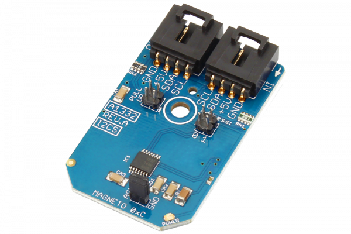

[](https://store.ncd.io/product/a1332-precision-hall-effect-rotational-angle-0-to-360-sensor-i2c-mini-module/)

#  A1332

The A1332 is a 360° contactless high-resolution programmable magnetic angle position sensor. It is designed for digital systems using an I2C interface.
This Device is available from www.ncd.io

[SKU:  A1332_I2CS]

(https://store.ncd.io/product/a1332-precision-hall-effect-rotational-angle-0-to-360-sensor-i2c-mini-module/)
This Sample code can be used with Raspberry Pi.

Hardware needed to interface A1332 Hall Effect Roational Sensor With Raspberry Pi: 

1. <a href="https://store.ncd.io/product/a1332-precision-hall-effect-rotational-angle-0-to-360-sensor-i2c-mini-module/">A1332 Hall Effect Roational Sensor</a>

2. <a href="https://store.ncd.io/product/i2c-shield-for-raspberry-pi-3-pi2-with-outward-facing-i2c-port-terminates-over-hdmi-port/">Raspberry Pi I2C Shield</a>

3. <a href="https://store.ncd.io/product/i%C2%B2c-cable//">I2C Cable</a>

# Python

Download and install smbus library on Raspberry pi. Steps to install smbus are provided at:

https://pypi.python.org/pypi/smbus-cffi/0.5.1

Download (or git pull) the code in pi. Run the program.

```cpp
$> python A1332.py
```
The lib is a sample library, you will need to calibrate the sensor according to your application requirement.
